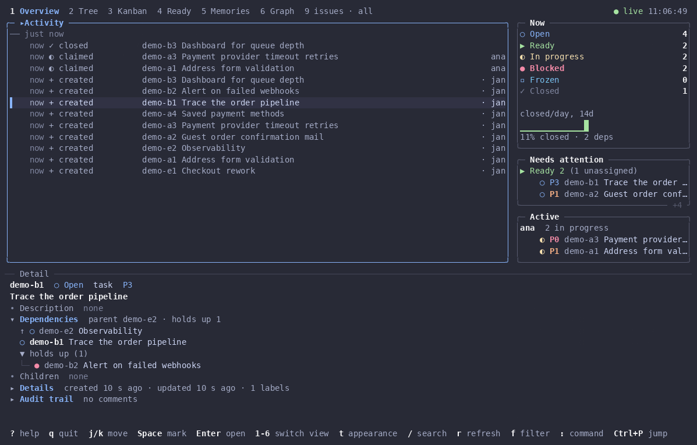

# bdash

A terminal dashboard for the [bd (beads)](https://github.com/steveyegge/beads) issue tracker, built with Bubble Tea v2. It shows an overview, a tree, a kanban board, the ready list, memories and the dependency graph of one workspace, refreshes itself when bd changes, and edits issues through bd.



## Install

Homebrew (macOS and Linux):

```sh
brew install janlink/tap/bdash
```

Go:

```sh
go install github.com/janlink/beads-dash/cmd/bdash@latest
```

Release archives for linux and darwin (amd64, arm64) and a bare `bdash_<version>_windows_amd64.exe` are attached to each [GitHub release](https://github.com/janlink/beads-dash/releases), with `checksums.txt`, an SBOM per archive and build provenance. Verify an archive with `sha256sum -c checksums.txt --ignore-missing` or `gh attestation verify <file> --repo janlink/beads-dash`.

bdash needs the `bd` binary on the `PATH` (or `BDASH_BD`). It supports the bd releases listed by `bdash --version`.

## Use

```sh
bdash [path]        # path is the workspace directory, default: the current one
bdash --view kanban
```

`?` lists every key, `:` opens the command bar, `x` exports the marked, current or scoped issues to the clipboard or a file (`:export md|json|text [path]` skips the dialog). `bdash --help` lists flags, files and environment variables.

## Development

Requires Go (see `go.mod`), [just](https://github.com/casey/just) and git.

```sh
just ci            # tidy, format, lint, vet, build, full tests, release and workflow checks
just test-short    # skip the real-bd integration tests
just golden-update # rewrite golden files after an intended rendering change
just demo          # re-record assets/demo.gif (needs agg)
```

Integration tests run against pinned bd releases installed into `.cache/bd/<version>/` by `scripts/install-bd.sh` (checksum-verified). Point `BDASH_TEST_BD_1_2_2` / `BDASH_TEST_BD_1_3_0` or `BDASH_TEST_BD_DIR` at other binaries to override.

Releases: add a section to `CHANGELOG.md`, tag `vX.Y.Z` and push the tag. The release workflow runs the CI gate, then GoReleaser, which takes the release notes from the tag's changelog section. `just snapshot` builds every artefact locally without publishing.

## Acknowledgments

bdash is the Go rewrite of and successor to [bdui-next](https://github.com/janlink/bdui-next) (MIT), which is itself derived from [assimelha/bdui](https://github.com/assimelha/bdui). bdash follows their design; no code was copied.

It exists because of [bd](https://github.com/steveyegge/beads) by Steve Yegge and contributors, and it is built on the [Charm](https://charm.sh) libraries: Bubble Tea, Bubbles and Lip Gloss.

## License

MIT, see [LICENSE](LICENSE).
